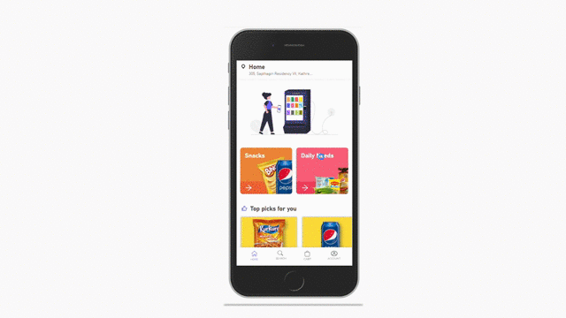

# JustVend: Smart Vending Machine

Vending Machines have become an essential part of our modern offices and educational institutes. They have a lot of advantages over traditional canteens and have become a necessity for offices. However in India , these vending machines have only been confined to a limited number of offices and educational institutes due to high installation and maintenance costs of these machines . Our teams at NEWRA realized this problem and we have come up with a new and innovative way to produce these machines. Using IOT ,we have reduced the cost of these machines by 60-70% and made them affordable for our Indian market needs . . The customer gets an application which can be downloaded easily on their smartphones and they can select which items to buy and pay the cost online . This makes justVend not only easy to operate but decreases the amount of maintenance. In conclusion , justVend fits perfectly for this age of technology and according to the needs of the Indian market.
